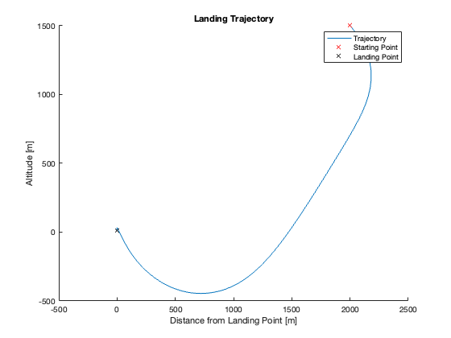
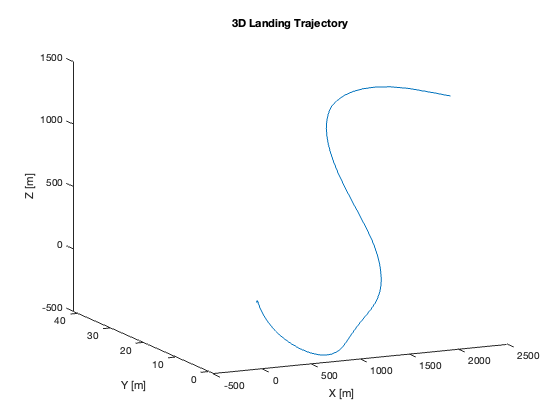
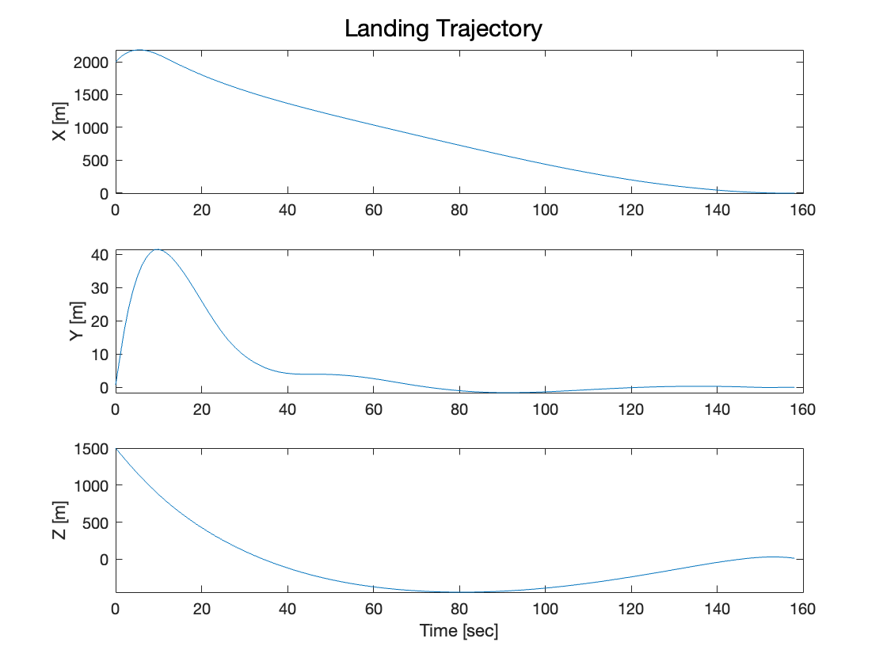
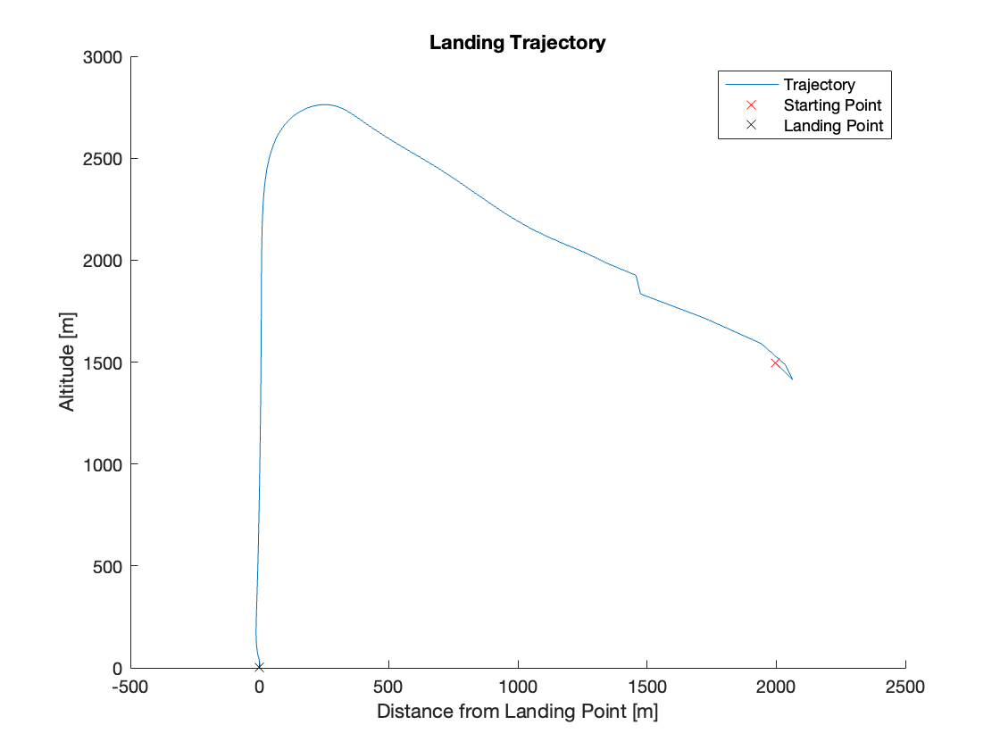
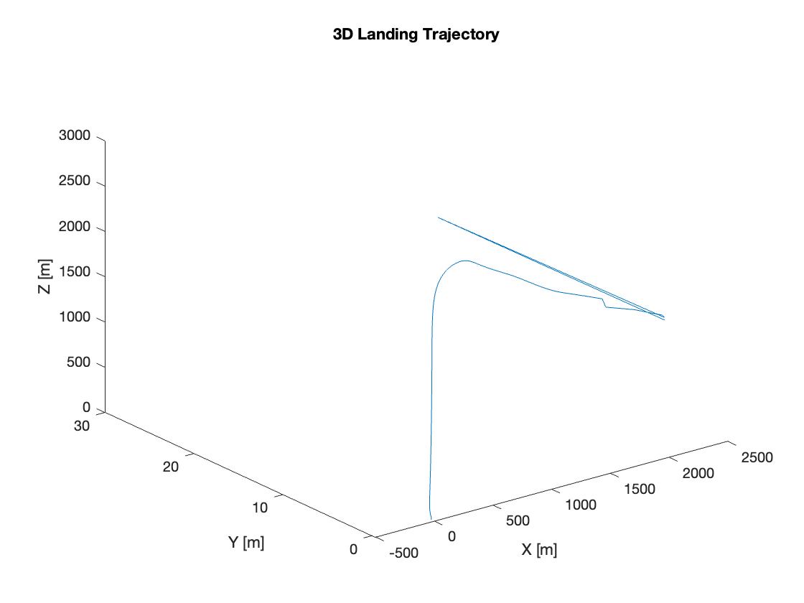
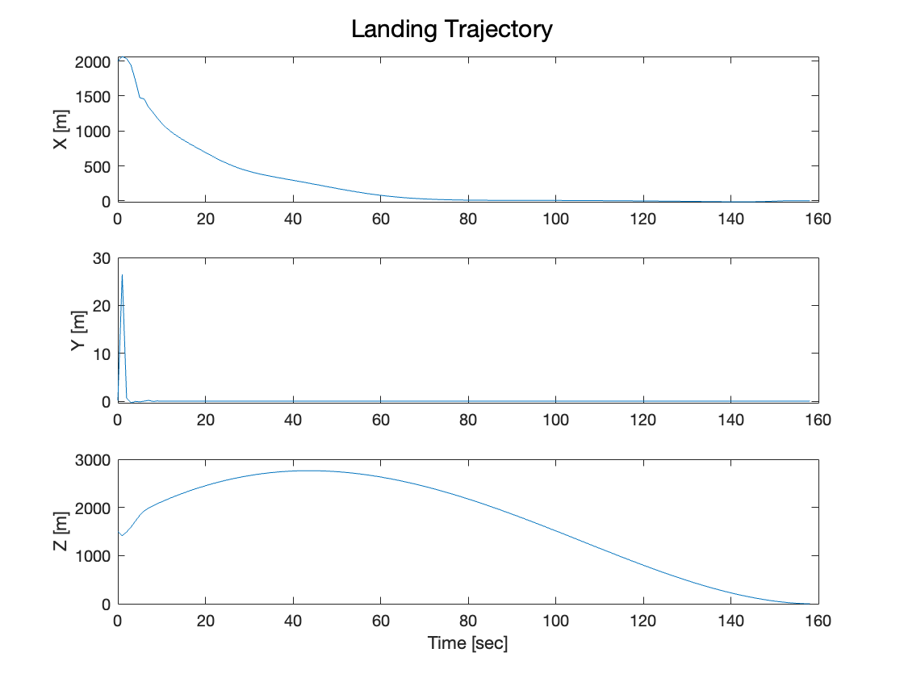

# Pinpoint Rocket Landing

## Background
Trajectory generation of an arbitrary rocket following the path laid out in *Convex Optimization for Trajectory Optimization: A Tutorial on Generating Dynamically Feasible Trajectories Reliably and Efficiently*, D. Malyuta et al.

Several suboptimal solutions were found (data can be found in **mat_files** directory). While the focus of the paper was Convex Optimization and Second Order Cone Programming, MATLAB is more suited to use *fmincon*, another approach to minimizing functions. *fmincon* is substantially slower than other SOCP solvers and, consequentially, takes ~30-45min to generate a 150 second trajectory given the constraints.
 
Dynamics of the rocket were encoded as individual constraints at each time step constrained by the amount of propellant onboard the vehicle. A standard state propagator was used, dissimilar to the approach in the paper, to define how the state changes over time.

Some interesting trajectories were generated such as a subsurface flight (violation of the glideslope constraints)

and a technically feasible trajectory that approaches the ground vertically instead of following the glideslope closer

Future work includes modifying constraints and possibly porting the code to a lighter language e.g., Python to improve performance. It should be noted that the SOCP solver and constraint handler used in the paper, [ECOS](https://github.com/embotech/ecos) and [JuMP](https://github.com/jump-dev/JuMP.jl) respectively, were not used as there was no obvious support for MATLAB. ECOS has better Python support, although JuMP appears to be [Julia](https://julialang.org/) specific.
